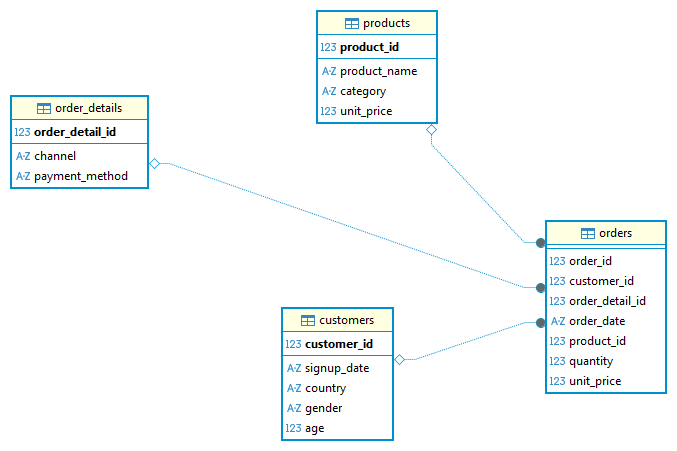

# Analyse E commerce en SQL
Un projet d'analyse de données e-commerce construit de A à Z : génération des données, modélisation, requêtes analytiques et recommendations.

---

## Pourquoi ce projet ?

Je voulais travailler sur un jeu de données e-commerce réaliste sans dépendre d'un dataset existant. J'ai donc choisi de générer mes propres données en SQL — ce qui m'a forcé à réfléchir à la modélisation avant même d'écrire la moindre requête d'analyse.

L'idée était simple : **partir d'un schéma vide et arriver à une segmentation client complète**, en passant par toutes les étapes intermédiaires qu'on rencontre dans un vrai projet data.

---

## Le schéma

Quatre tables, des relations claires, un modèle en étoile compatible Power BI.

```
customers ──► orders ◄── order_details
                │
                ▼
            products
```

| Table | Contenu |
|-------|---------|
| `customers` | 1 000 clients, 5 pays, signup entre 2022 et 2025 |
| `products` | 40 produits, 5 catégories (Electroniques, Maison, Sport, Beauté et Fashion) , prix réalistes |
| `orders` | ~13. 000 lignes — 1 ligne par produit par commande |
| `order_details` | 6 combinaisons canal (web/mobile) × paiement |

**Choix de modélisation :** `channel` et `payment_method` sont isolés dans `order_details` pour éviter la redondance dans `orders` et faciliter les analyses par canal.

---

## Génération des données

Avant d'analyser, il faut des données cohérentes. Quelques contraintes que je me suis imposées :

- `order_date` toujours ≥ `signup_date` du client
- Toutes les dates bornées entre 2022 et 2025-12-31
- Distribution des clients irrégulière sur les 4 années (pas de quota fixe par année)
- Nombre de commandes variable par client : tous passent au moins 1 commande, certains en passent jusqu'à 5
- 1 à 5 produits par commande
- Prix fixés par produit (réalistes, pas aléatoires)

```sql

-- TABLE CUSTOMERS

CREATE TABLE customers (
    customer_id  INTEGER PRIMARY KEY AUTOINCREMENT,
    signup_date  TEXT,
    country      TEXT,
    gender       TEXT,
    age          INTEGER
);

INSERT INTO customers (signup_date, country, gender, age)
SELECT
    date('2022-01-01', '+' || abs(random() % 1461) || ' days'),
    CASE abs(random() % 5)
        WHEN 0 THEN 'France'
        WHEN 1 THEN 'Germany'
        WHEN 2 THEN 'Spain'
        WHEN 3 THEN 'Italy'
        ELSE        'Belgium'
    END,
    CASE abs(random() % 2)
        WHEN 0 THEN 'M'
        ELSE        'F'
    END,
    18 + abs(random() % 50)
FROM (SELECT 1 UNION ALL SELECT 2 UNION ALL SELECT 3 UNION ALL SELECT 4 UNION ALL SELECT 5
      UNION ALL SELECT 6 UNION ALL SELECT 7 UNION ALL SELECT 8 UNION ALL SELECT 9 UNION ALL SELECT 10) a,
     (SELECT 1 UNION ALL SELECT 2 UNION ALL SELECT 3 UNION ALL SELECT 4 UNION ALL SELECT 5
      UNION ALL SELECT 6 UNION ALL SELECT 7 UNION ALL SELECT 8 UNION ALL SELECT 9 UNION ALL SELECT 10) b,
     (SELECT 1 UNION ALL SELECT 2 UNION ALL SELECT 3 UNION ALL SELECT 4 UNION ALL SELECT 5
      UNION ALL SELECT 6 UNION ALL SELECT 7 UNION ALL SELECT 8 UNION ALL SELECT 9 UNION ALL SELECT 10) c;


-- TABLE PRODUCTS — 40 produits uniques (8 par catégorie)

CREATE TABLE products (
    product_id   INTEGER PRIMARY KEY AUTOINCREMENT,
    product_name TEXT,
    category     TEXT,
    unit_price   REAL
);

INSERT INTO products (product_name, category, unit_price) VALUES
-- Electronics : 15€ à 299€
('Wireless Headphones',  'Electronics', ROUND(49  + abs(random() % 150), 2)),
('Bluetooth Speaker',    'Electronics', ROUND(29  + abs(random() % 100), 2)),
('USB-C Hub',            'Electronics', ROUND(15  + abs(random() % 45),  2)),
('Mechanical Keyboard',  'Electronics', ROUND(59  + abs(random() % 120), 2)),
('Webcam HD',            'Electronics', ROUND(39  + abs(random() % 80),  2)),
('Smart Watch',          'Electronics', ROUND(99  + abs(random() % 200), 2)),
('Portable Charger',     'Electronics', ROUND(19  + abs(random() % 50),  2)),
('LED Desk Lamp',        'Electronics', ROUND(25  + abs(random() % 60),  2)),
-- Fashion : 12€ à 250€
('Slim Fit Jeans',       'Fashion',     ROUND(29  + abs(random() % 70),  2)),
('Wool Sweater',         'Fashion',     ROUND(39  + abs(random() % 80),  2)),
('Leather Jacket',       'Fashion',     ROUND(89  + abs(random() % 160), 2)),
('Running Sneakers',     'Fashion',     ROUND(49  + abs(random() % 120), 2)),
('Canvas Tote Bag',      'Fashion',     ROUND(12  + abs(random() % 40),  2)),
('Silk Scarf',           'Fashion',     ROUND(25  + abs(random() % 75),  2)),
('Chino Pants',          'Fashion',     ROUND(29  + abs(random() % 60),  2)),
('Polo Shirt',           'Fashion',     ROUND(19  + abs(random() % 50),  2)),
-- Home : 8€ à 200€
('Bamboo Cutting Board', 'Home',        ROUND(12  + abs(random() % 30),  2)),
('Coffee Maker',         'Home',        ROUND(39  + abs(random() % 120), 2)),
('Throw Pillow',         'Home',        ROUND(12  + abs(random() % 35),  2)),
('Scented Candle',       'Home',        ROUND(8   + abs(random() % 30),  2)),
('Air Purifier',         'Home',        ROUND(59  + abs(random() % 140), 2)),
('Storage Basket',       'Home',        ROUND(10  + abs(random() % 30),  2)),
('Non-stick Pan',        'Home',        ROUND(25  + abs(random() % 70),  2)),
('Wall Clock',           'Home',        ROUND(15  + abs(random() % 50),  2)),
-- Beauty : 5€ à 120€
('Vitamin C Serum',      'Beauty',      ROUND(19  + abs(random() % 60),  2)),
('Moisturizing Cream',   'Beauty',      ROUND(12  + abs(random() % 45),  2)),
('Hair Mask',            'Beauty',      ROUND(8   + abs(random() % 30),  2)),
('Lip Balm Set',         'Beauty',      ROUND(5   + abs(random() % 20),  2)),
('Face Wash Gel',        'Beauty',      ROUND(8   + abs(random() % 25),  2)),
('Eye Contour Cream',    'Beauty',      ROUND(15  + abs(random() % 50),  2)),
('Perfume 50ml',         'Beauty',      ROUND(35  + abs(random() % 85),  2)),
('Nail Polish Kit',      'Beauty',      ROUND(10  + abs(random() % 30),  2)),
-- Sports : 5€ à 100€
('Yoga Mat',             'Sports',      ROUND(19  + abs(random() % 50),  2)),
('Resistance Bands',     'Sports',      ROUND(8   + abs(random() % 25),  2)),
('Water Bottle 750ml',   'Sports',      ROUND(10  + abs(random() % 25),  2)),
('Foam Roller',          'Sports',      ROUND(15  + abs(random() % 35),  2)),
('Jump Rope',            'Sports',      ROUND(5   + abs(random() % 20),  2)),
('Gym Gloves',           'Sports',      ROUND(10  + abs(random() % 25),  2)),
('Protein Shaker',       'Sports',      ROUND(8   + abs(random() % 20),  2)),
('Sports Towel',         'Sports',      ROUND(5   + abs(random() % 20),  2));


-- TABLE ORDER_DETAILS

CREATE TABLE order_details (
    order_detail_id  INTEGER PRIMARY KEY AUTOINCREMENT,
    channel          TEXT,
    payment_method   TEXT
);

INSERT INTO order_details (channel, payment_method) VALUES
('web',    'card'),
('web',    'E-wallet'),
('web',    'Klarna'),
('mobile', 'card'),
('mobile', 'E-wallet'),
('mobile', 'Klarna');


-- TABLE ORDERS

CREATE TABLE orders (
    order_id        INTEGER,
    customer_id     INTEGER,
    order_detail_id INTEGER,
    order_date      TEXT,
    product_id      INTEGER,
    quantity        INTEGER,
    unit_price      REAL,
    FOREIGN KEY (customer_id)    REFERENCES customers(customer_id),
    FOREIGN KEY (order_detail_id) REFERENCES order_details(order_detail_id),
    FOREIGN KEY (product_id)     REFERENCES products(product_id)
);

-- Étape 1 : table temporaire des commandes (1 ligne = 1 commande unique)
CREATE TEMPORARY TABLE temp_orders AS
SELECT
    ROW_NUMBER() OVER () AS order_id,
    c.customer_id,
    1 + abs(random() % 6) AS order_detail_id,
    date(c.signup_date, '+' || (abs(random() % MAX(1, CAST(julianday('2025-12-31') - julianday(c.signup_date) AS INTEGER)))) || ' days') AS order_date
FROM customers c,
     (SELECT 1 UNION ALL SELECT 2 UNION ALL SELECT 3) extra  -- base ~3000 commandes
-- Blocs supplémentaires pour distribution variable
UNION ALL
SELECT
    ROW_NUMBER() OVER () + 3000,
    c.customer_id,
    1 + abs(random() % 6),
    date(c.signup_date, '+' || (abs(random() % MAX(1, CAST(julianday('2025-12-31') - julianday(c.signup_date) AS INTEGER)))) || ' days')
FROM customers c WHERE abs(random() % 4) < 3   -- 75%
UNION ALL
SELECT
    ROW_NUMBER() OVER () + 4000,
    c.customer_id,
    1 + abs(random() % 6),
    date(c.signup_date, '+' || (abs(random() % MAX(1, CAST(julianday('2025-12-31') - julianday(c.signup_date) AS INTEGER)))) || ' days')
FROM customers c WHERE abs(random() % 2) = 0;  -- 50%

-- Étape 2 : éclater chaque commande en 1 à 5 lignes produits
-- nb_produits est tiré aléatoirement entre 1 et 5 pour chaque commande
INSERT INTO orders (order_id, customer_id, order_detail_id, order_date, product_id, quantity, unit_price)
SELECT
    t.order_id,
    t.customer_id,
    t.order_detail_id,
    t.order_date,
    p.product_id,
    1 + abs(random() % 5)  AS quantity,
    p.unit_price
FROM temp_orders t
-- Générer entre 1 et 5 lignes par commande via jointure sur une série filtrée
JOIN (SELECT 1 AS n UNION ALL SELECT 2 UNION ALL SELECT 3
      UNION ALL SELECT 4 UNION ALL SELECT 5) serie
  ON serie.n <= 1 + abs(random() % 5)
-- Tirer un produit aléatoire parmi les 40
JOIN (
    SELECT product_id, unit_price,
           ROW_NUMBER() OVER () AS rn
    FROM products
) p ON p.rn = 1 + abs(random() % 40);

-- Nettoyage
DROP TABLE IF EXISTS temp_orders;
```

Après exécution de la requête ci-dessus, j'ai le modèle suivant: 




## Analyses

### 1. Performance temporelle

**Question :** Comment évolue le CA mois par mois ? Y a-t-il des tendances annuelles ?

Je commence toujours par une vue temporelle — c'est le socle de toute analyse e-commerce. Elle permet de détecter les tendances avant de chercher à les expliquer.

```sql
SELECT
    strftime('%Y', order_date) AS annee,
    strftime('%m', order_date) AS mois,
    ROUND(SUM(quantity * unit_price), 2) AS CA,
    COUNT(DISTINCT order_id)             AS nb_commandes
FROM orders
GROUP BY annee, mois
ORDER BY annee, mois;
```

📄 [`analysis_temporal.sql`](./sql/analysis_temporal.sql)

---

### 2. Saisonnalité

**Question :** Certains mois sont-ils structurellement plus forts, toutes années confondues ?

Plutôt que de regarder chaque mois individuellement, je calcule l'écart par rapport à la moyenne globale — ce qui permet de voir les pics réels indépendamment de la croissance année sur année.

```sql
-- Écart en % par rapport à la moyenne globale
ROUND((ca_moyen - moyenne_globale) * 100.0 / moyenne_globale, 1) AS ecart_pct
```

📄 [`analysis_seasonality.sql`](./sql/analysis_seasonality.sql)

---

### 3. Produits

**Question :** Quels produits génèrent le plus de CA ? Les plus vendus sont-ils les plus rentables ?

J'analyse les deux dimensions séparément car elles peuvent raconter des histoires opposées : un produit à 9.99€ vendu 500 fois génère moins de CA qu'un produit à 199.99€ vendu 80 fois.

```sql
SELECT p.product_name, p.category,
       SUM(o.quantity)                          AS quantity_sold,
       ROUND(SUM(o.quantity * o.unit_price), 2) AS CA,
       ROUND(SUM(o.quantity * o.unit_price)
             / SUM(o.quantity), 2)              AS prix_moyen
FROM products p
INNER JOIN orders o ON p.product_id = o.product_id
GROUP BY p.product_id
ORDER BY CA DESC;
```

📄 [`analysis_products.sql`](./sql/analysis_products.sql)

---

### 4. Canaux & Paiement

**Question :** Les comportements d'achat diffèrent-ils entre web et mobile ?

Je regarde le panier moyen par canal — pas juste le volume — pour voir si les clients mobiles achètent différemment des clients web.

```sql
SELECT
    od.channel,
    COUNT(DISTINCT o.order_id)                     AS nb_commandes,
    ROUND(SUM(o.quantity * o.unit_price), 2)       AS CA,
    ROUND(SUM(o.quantity * o.unit_price)
          / COUNT(DISTINCT o.order_id), 2)         AS panier_moyen
FROM orders o
INNER JOIN order_details od ON o.order_detail_id = od.order_detail_id
GROUP BY od.channel;
```

📄 [`analysis_channels.sql`](./sql/analysis_channels.sql)

---

### 5. Segmentation RFM

**Question :** Comment classer les clients selon leur comportement d'achat pour cibler les bonnes actions marketing ?

Le RFM est l'aboutissement logique du projet : après avoir compris les tendances globales, je descends au niveau client. Chaque client reçoit un score sur 3 dimensions (Récence, Fréquence, Montant) via `NTILE(5)`, puis est assigné à un segment.

| Segment | Condition | Action |
|---------|-----------|--------|
| Champion | R=5, F=5, M=5 | Programme VIP |
| Client fidèle | F=5 | Récompenser |
| Nouveau client | R=5, F=1 | Encourager 2e achat |
| Client à risque | R≤2, F≥4 | Relancer rapidement |
| Client prometteur | R≥3, F≥3 | Nurturing |
| Client inactif | R≤2, F≤3 | Réactivation |
| Client perdu | R=1, F=1, M=1 | Win-back ou abandon |

```sql
-- Score Récence : 5 = le plus récent
6 - NTILE(5) OVER (ORDER BY recence ASC) AS score_r
-- Score Fréquence et Montant : 5 = le meilleur
NTILE(5) OVER (ORDER BY frequence ASC)  AS score_f
NTILE(5) OVER (ORDER BY montant ASC)    AS score_m
```

> **Pourquoi `6 - NTILE` pour la récence ?** `NTILE` attribue 1 aux plus petites valeurs. Or une petite récence (peu de jours depuis le dernier achat) signifie un bon client — il faut donc inverser.

📄 [`analysis_rfm.sql`](./sql/analysis_rfm.sql)

---

## Structure du projet

```
ecommerce-sql-analysis/
├── README.md
├── sql/
│   ├── generate_data.sql
│   ├── analysis_temporal.sql
│   ├── analysis_seasonality.sql
│   ├── analysis_products.sql
│   ├── analysis_channels.sql
│   └── analysis_rfm.sql
└── powerbi/
    └── dashboard.pbix
```

---

## Stack


---

*[Votre Nom](https://github.com/votre-profil)*
